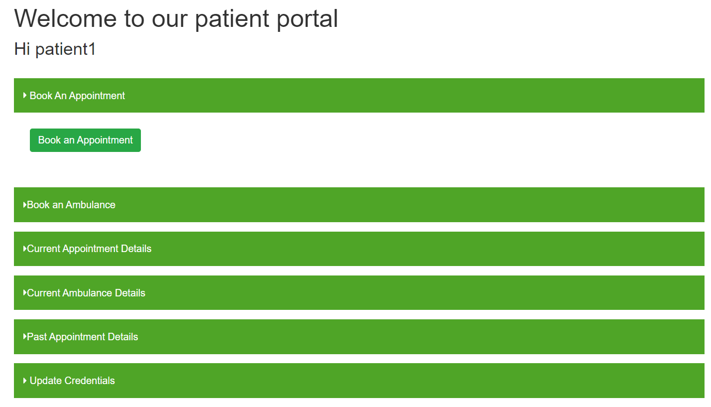
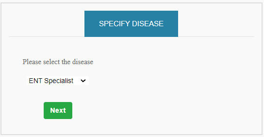
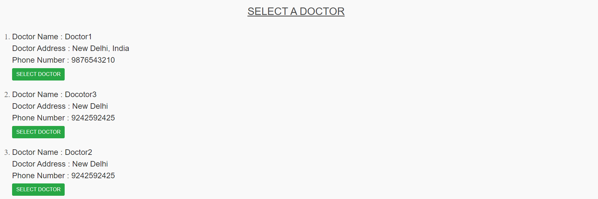
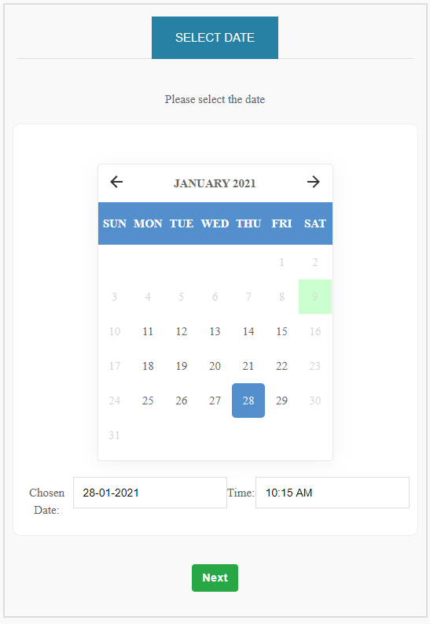
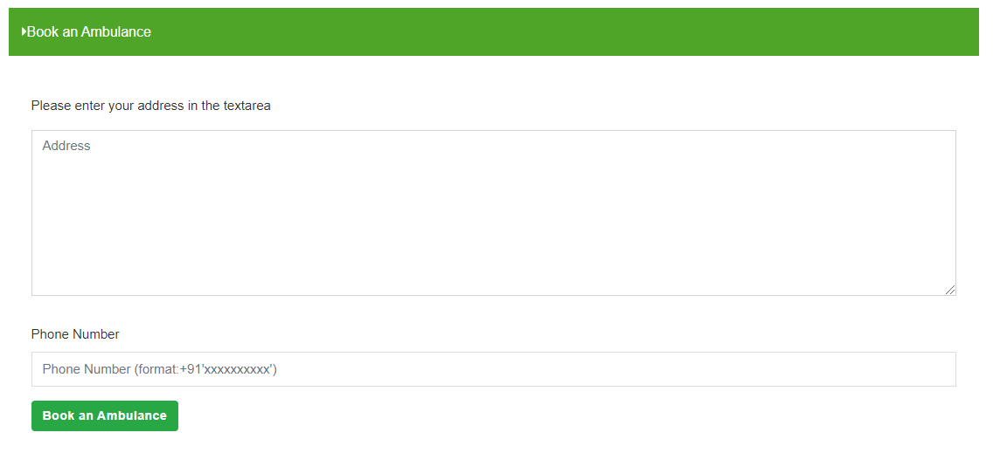
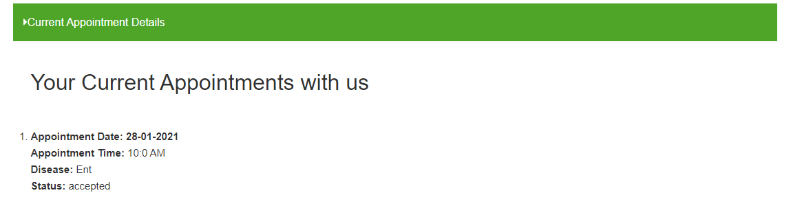
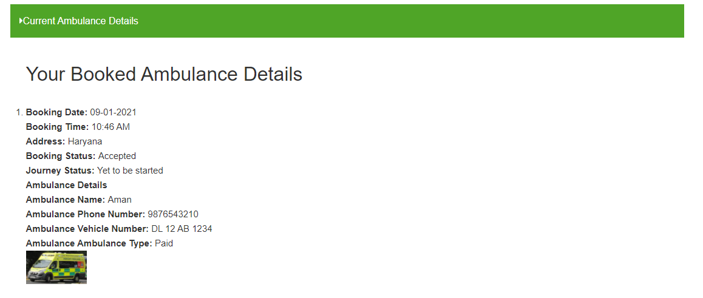
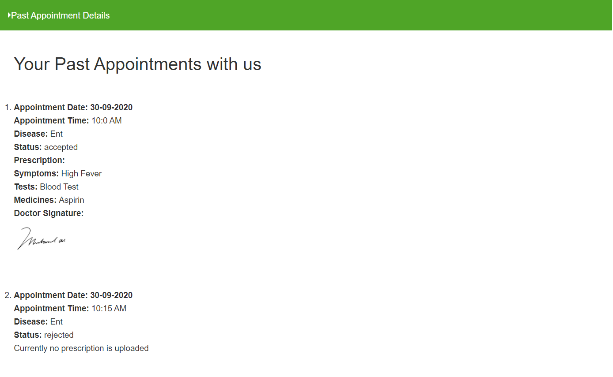
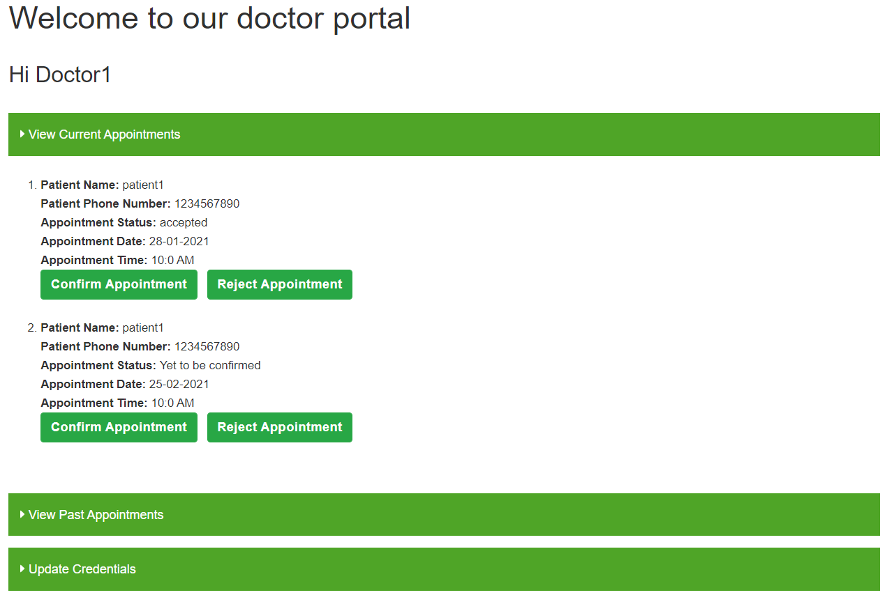
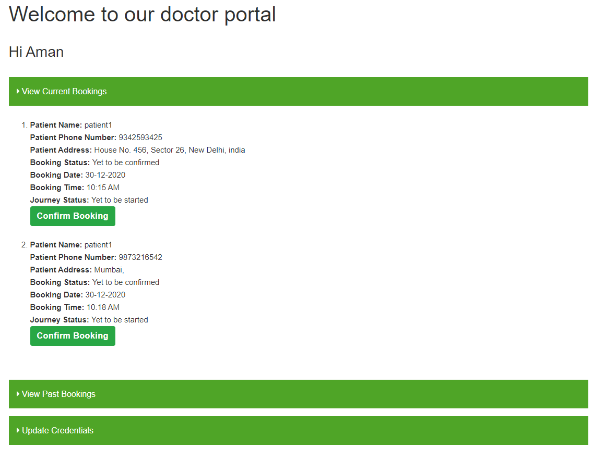

# User Documentation

A user can register and login as a Patient, Doctor or an Ambulance Service Provider

## Patient Portal

On successful login the patient is redirected to the patient portal where the following options are present :

- Book An Appointment
- Book An Ambulance
- Current Appointment Details
- Current Ambulance Details
- Past Appointment Details
- Update Credentials

### Book An Appointment

Choose the doctor specialization and click next

Select your nearby doctor from the given list

Pick a suitable date from the calendar and an appointment time will be provided automatically based on doctor's schedule

You will be redirected to the patient portal where in the current appointment section you can view the appointment details

### Book An Ambulance

Enter your address and phone number in the form and click on Book an Ambulance button.
A real time mail will be sent to all the ambulance provider and the nearest one will start the journey.

### Current Appointment Details

Displays the list of details of your current appointments.

### Current Ambulance Details

Shows the details of the booked ambulance.

### Past Appointment Details

Present the details of your past appointments and doctor's prescription.

### Update Credentials

Gives an option to update the user details.

## Doctor Portal

On successful login the doctor is redirected to the doctor portal where the following options are present :

- View Current Appointment
- View Past Appointment
- Update Credentials

### View Current Appointment

Provides an option to accept or reject an appointment

### View Past Appointment

One can view past appointments and has an option to upload prescription for past appointment

### Update Credentials

Gives an option to update the user details.

## Ambulance Portal

On successful login the ambulance service provider is redirected to the ambulance portal where the following options are present :

- View Current Bookings
- View Past Bookings
- Update Credentials

### View Current Bookings

Provides an option to confirm the ambulance booking and start the journey.

### View Past Bookings

One can view the details of past ambulance bookings.

### Update Credentials

Gives an option to update the user details.